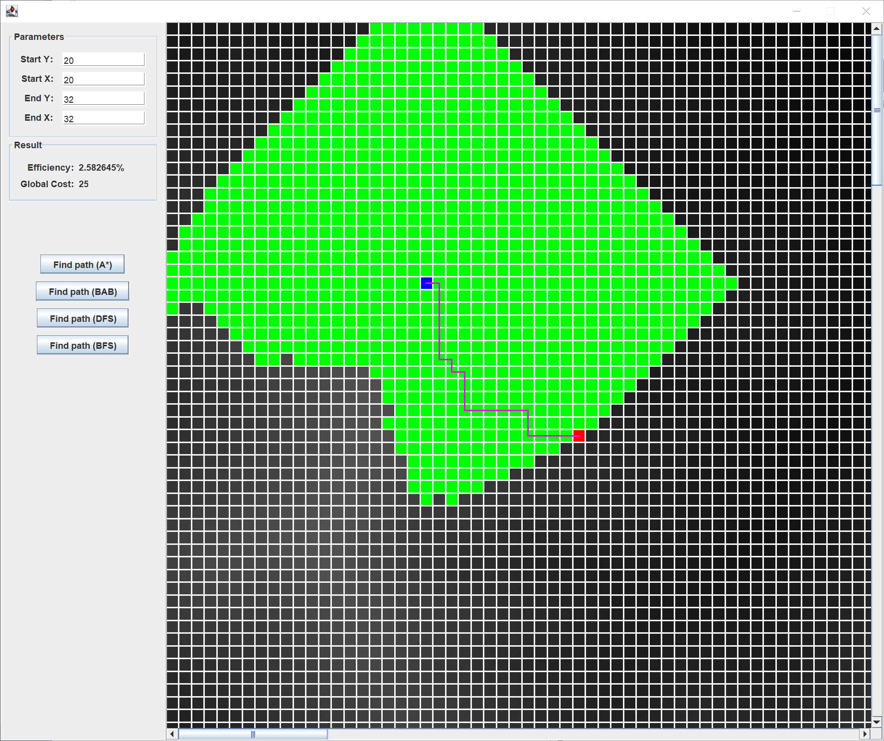
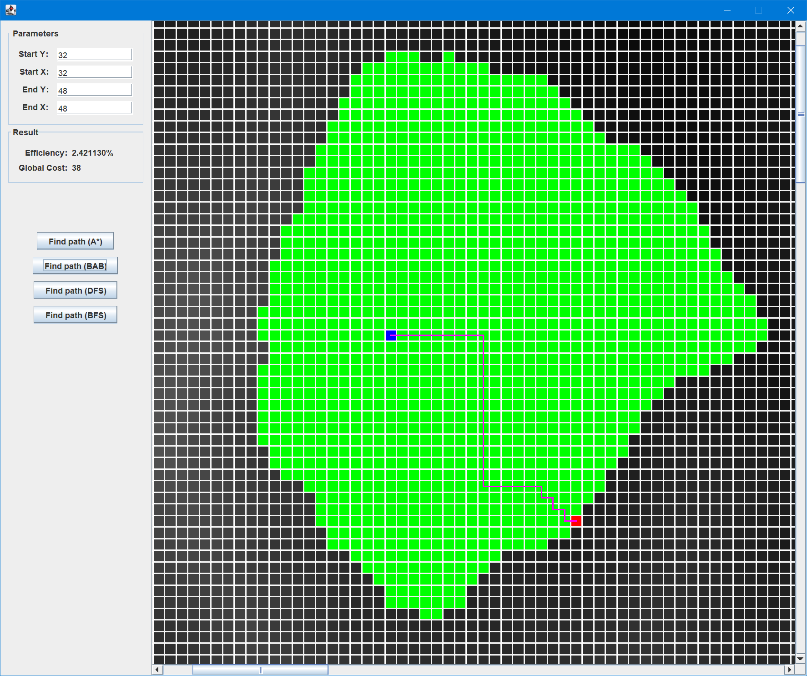
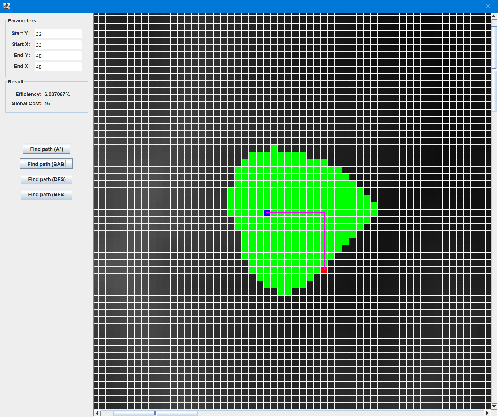
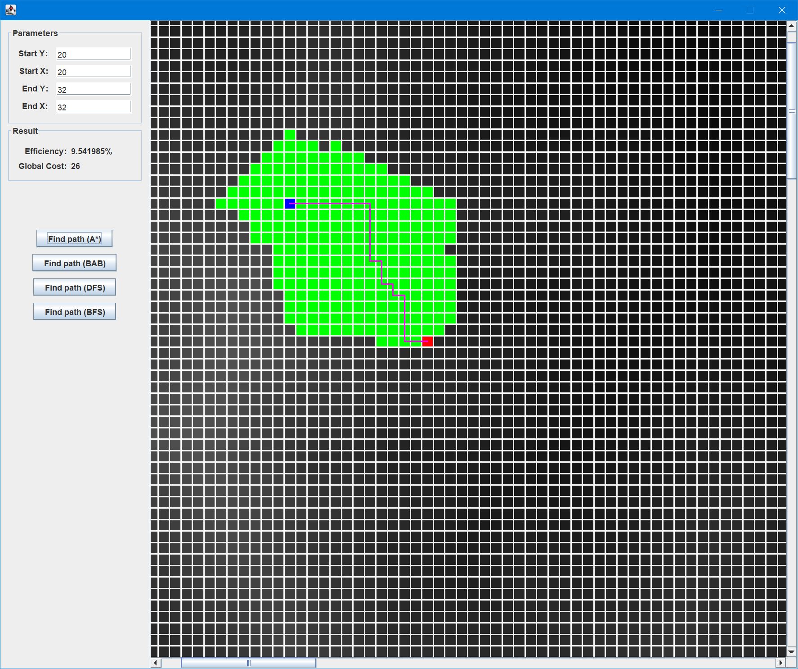
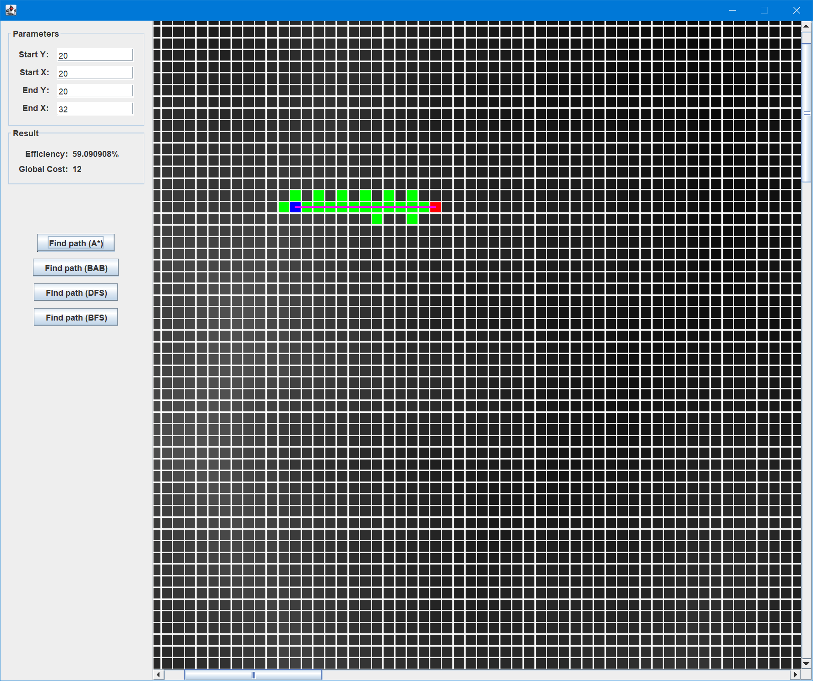
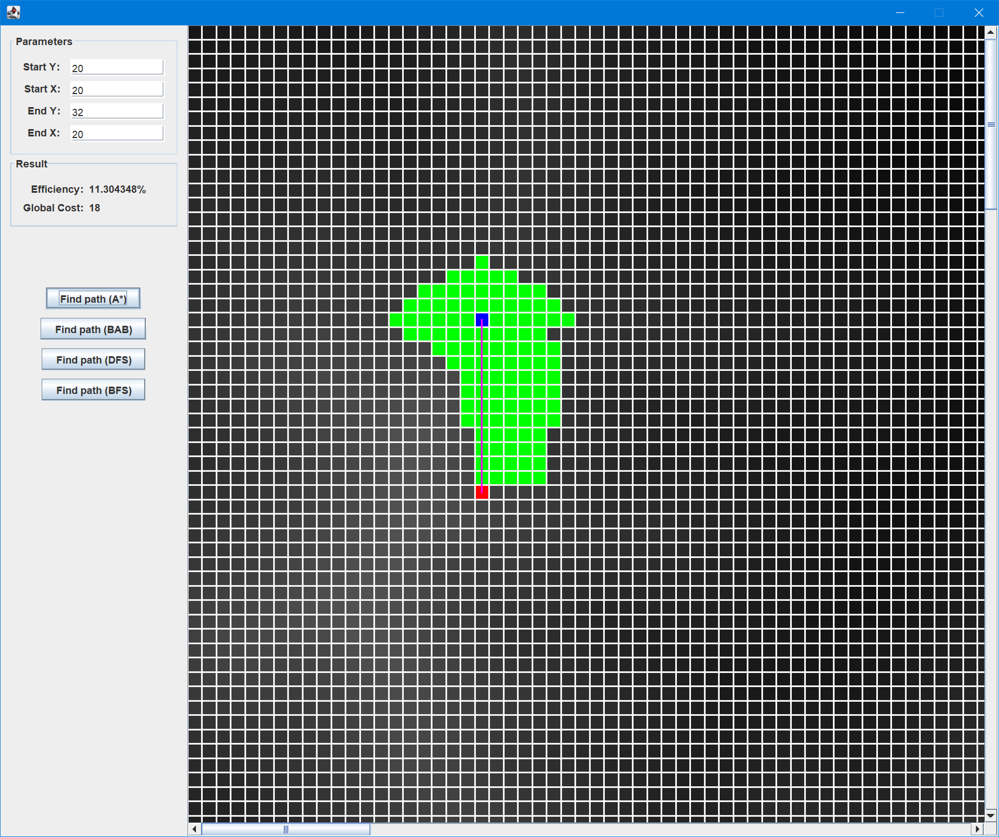
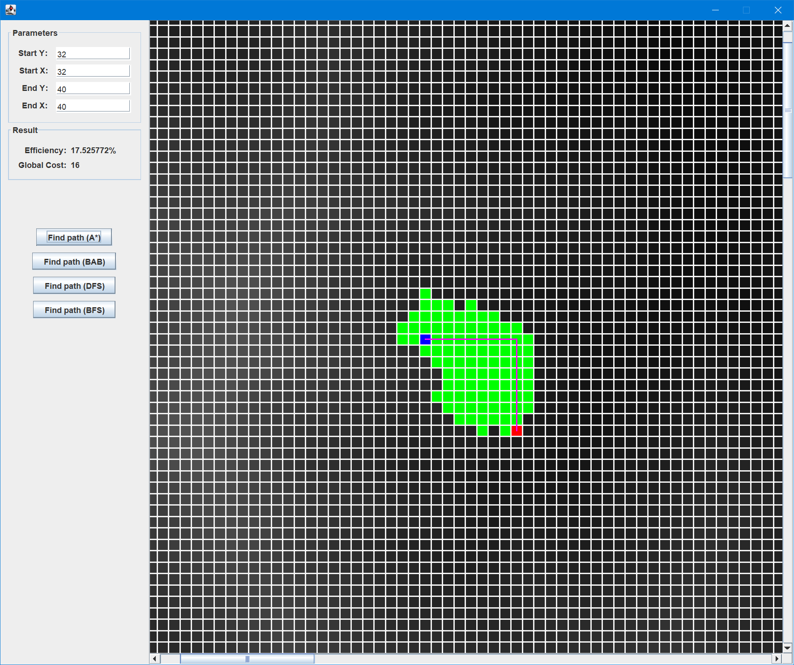
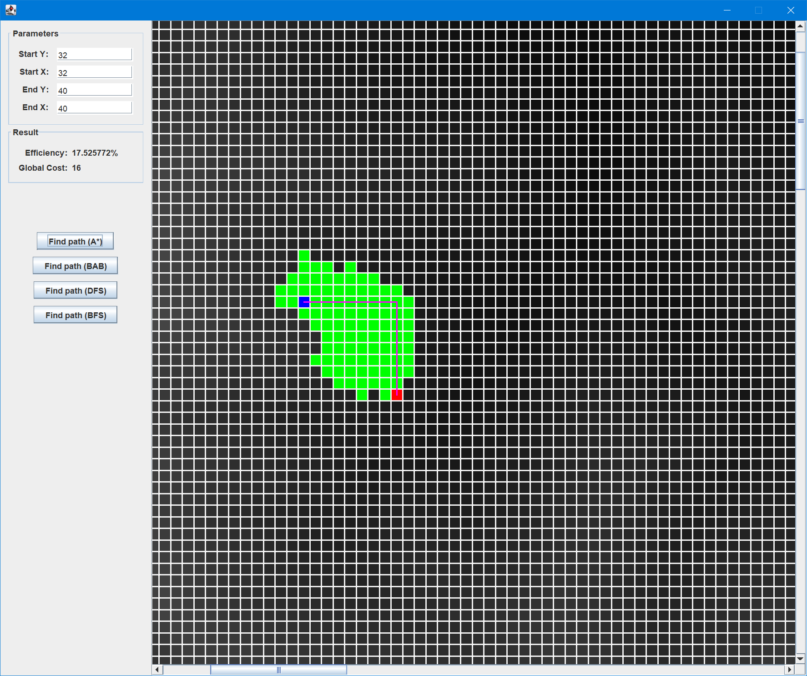

## Description of my branch-and-bound implementation

维护两个列表 

- *open* 用于存放待处理的节点
- *closed* 用于存放已经处理过的节点

当 *open* 列表不为空时，执行以下操作

1. 每次从 *open* 列表中选取 $n.GC$ 最小的节点 $n$，随后将节点 $n$ 从 *open* 列表中移除。

2. 如果节点 $n$ 是目标节点，则节点 $n$ 以及它对应的路径为最优路径

3. 如果节点 $n$ 不是目标节点

   1. 生成 $k$ 个后继节点 $s_1, s_2, ..., s_k$ 并设置对应的 *Local cost* $s_i.LC$ 和 *Global cost* $s_i.GC$ ( $s_i.GC = s_i.LC + n.GC$)。在本次实验中，$s_i.LC$ 的计算采用 *Rambler's* 算法。

   2. 遍历 *open* 列表，是否存在一个节点 $n_i$ 与 $s_i$ 表示同一坐标 $(y, x)$ ，如果存在且 $s_i.GC < n_i.GC$，则用 $s_i$ 的状态替换 $n_i$ 的状态

   3. 将 $s_{1...4}$ 添加到 *open* 列表中
   4. 将节点 $n$ 添加到 *closed* 列表中
   5.  重复步骤 1

## Description of my A* implementation

维护两个列表 

- *open* 用于存放待处理的节点
- *closed* 用于存放已经处理过的节点

当 *open* 列表不为空时，执行以下操作

1. 每次从 *open* 列表中选取 $n.RemRC$ 最小的节点 $n$，随后将节点 $n$ 从 *open* 列表中移除。

2. 如果节点 $n$ 是目标节点，则节点 $n$ 以及它对应的路径为最优路径

3. 如果节点 $n$ 不是目标节点

   1. 生成 $k$ 个后继节点 $s_1, s_2, ..., s_k$ 并设置对应的 *Estimated remained cost* $s_i.RemRC$ ($s_i.RemRC = H(s_i)$), *Local cost* $s_i.LC$, *Global cost* $s_i.GC$ ( $s_i.GC = s_i.LC + n.GC$)。

   2. 遍历 *open* 列表，是否存在一个节点 $n_i$ 与 $s_i$ 表示同一坐标 $(y, x)$ ，如果存在且 $s_i.GC < n_i.GC$，则用 $s_i$ 的状态替换 $n_i$ 的状态

   3. 将 $s_{1...4}$ 添加到 *open* 列表中
   4. 将节点 $n$ 添加到 *closed* 列表中
   5.  重复步骤 1

*A\** 算法的实现与 *branch-and-bound* 基本步骤相同，仅在从 *open* 中选取节点 *n* 时稍有变化，根据启发函数的估计结果 *Estimated Remained Cost*。

## Assessing the efficiency of my branch-and-bound search algorithm

以下是三组实验，每组实验所使用的地图数据均来自文件“diablo.pgm”。图中的软件位于源代码 “RunRamblersSwing.java”，图中 **蓝色方块** 表示搜索起点，**红色方框** 表示搜索终点，**紫色线条** 表示搜索路径，**绿色方块** 表示 *closed list* 中某节点状态对应于地图上的某一坐标。

- 实验 1

  - 实验内容：当路径是复杂路径时，寻路过程中 *closed list* 的情况

  - 实验结果：

    

- 实验 2

  - 实验内容：当路径是直线路径时，寻路过程中 *closed list* 的情况

  - 实验结果：

    

    

- 实验3

  - 实验内容：路径长短对于 *closed list* 的影响

  - 实验结果：

    

    

通过以上几组实验可以看出，*branch-and-bound* 算法最终的 *efficiency* 与路径的长度没有太多关系。结合本 *branch-and-bound* 实现思路，当地形越复杂，*efficiency* 会越低，这与本算法中使用到的贪心思想有很大关系。贪心算法是通过求得局部最优解进而求得全局最优解，在我们的算法实现中，我们对 *open list* 中 *local cost* 最小的节点进行优先求解。在这种条件下，当路径附近存在多个局部区域，每一个区域都与其他区域代价差值较小或相同，贪心算法会被这种局部最优解引导，从而进行了大量的额外的计算，尽管这些局部最优解可能与全局最优解还差得很远。

According to the samples, we can figure out some conclusions.

1. the *efficiency* of the result of *branch-and-bound* algorithm was almost no influence by the path's length.
2. Refer the implementation of the *branch-and-bound* algorithm, *efficiency* is in direct ratio to terrain's complexity. Because the *branch-and-bound* algorithm uses greedy thinking. The greedy algorithm finds the globally optimized solution through the locally optimized solution, in our experiment, it always choices the node with the **lowest** *local cost* in *open list*. In this case, if one more local regions that with the same difference or small difference to other regions has existed and near the path, those regions will affect the greedy algorithm, thereby quantity extra regions will be processed, even the regions is useless to the result.  

## Assessing the efficiency of my A* search algorithm

与上一个主题的采用相同的实验，但是使用算法使用 A* 版本

- 实验 1 

  - 实验结果：

    - 基于曼哈顿距离的启发算法

      

     - 基于欧式距离的启发算法
    
       

- 实验 2

  - 实验结果：

    - 基于曼哈顿距离的启发算法

      

      

    - 基于欧式距离的启发算法

      

      

- 实验 3

  - 实验结果：

    - 基于曼哈顿距离的启发算法

      
    
      
      
    - 基于欧氏距离的启发算法
    
      
    
      

通过以上几组实验可以看出，*A\** 算法的 *efficiency* 在多数时候要比 *branch-and-bound* 算法好，绿色方块多数情况下要比 *branch-and-bound* 算法少，也可以说 *A\** 算法相比 *branch-and-bound* 算法更精确地接近了目标。这要归功于它的 *启发函数* 。

*A\** 算法中计算代价时，代价函数可表示为 $ F = G + H $ ，其中 $G$ 表示起点到当前节点所花费的总代价，$H$ 叫做启发函数，表示从当前节点到目标节点的剩余代价的估计。*A\** 算法选取下一个节点时，会优先选取预估值 $H$ 最小的节点。因此，启发函数 $H$ 的选取，对于 *A\** 算法最终的效率有绝对的影响。***A\** 算法会沿着启发函数 $H$ 的梯度方向搜索，一个好的启发函数 $H$ 总能让 *A\** 算法更快地接近目标**。

通过分析代码实现，可以观察到 *A\** 算法极其依赖启发函数 $H$，如果启发函数 $H$ 选择不当，可能会导致 *A\** 算法停机时给出错误的目标。 

如果对于有向权重图 $G$，存在一条从 $p$ 到 $q$ 的最优路径 $\overrightarrow{\omega}$ 和 最远路径 $\overrightarrow{\phi}$，对于路径 $\overrightarrow{\omega}$，启发函数 $H$ 总能给出发散的梯度，对于路径 $\overrightarrow{\phi}$ ，启发函数 $H$ 总能给出收敛的梯度。那么 *A\** 算法在停机时总是无法找到最优路径 $\overrightarrow{\omega}$。因为对于路径 $\overrightarrow{\omega}$ 上的任意两个相邻的节点， 启发函数 $H$ 总能给出较大的估计值。所以，梯度方向将远离路径 $\overrightarrow{\omega}$ 的方向。

因此，启发函数 $H$ 的选择会影响 *A\** 算法的正确性。

我们总是希望寻路算法能够更快地从起点到达终点，我们在实验中选择了以下几个启发函数：

- 基于曼哈顿距离的启发函数
- 基于欧式距离的启发函数
- 基于高度变化的启发函数

通过实验结果，我们可以看出基于曼哈顿距离和基于欧式距离的启发函数最终得到的 *efficiency* 差值极小，这说明了只要启发函数 $H$ 能够精确描述节点到目标的梯度变化，那么 *A\** 算法就能精确找到目标。

## Comparing the two search strategies

1. 代码实现

   - *branch-and-bound* 算法在选择下一个状态时根据最小的实际代价确定。

   - *A\** 算法在选择下一个状态时根据最小的 *启发函数* 估计值确定。 

     两者具体实现过程中并没有太大差异，仅在选择下一个节点的条件上有所差别。

2. 搜索效率

   - *branch-and-bound* 算法采用相邻最小代价的方法选择下一个节点，这种方法会尝试每一个可能，会因为多个局部最优区域而增加计算量。

   - *A\** 算法使用了一种叫做 *启发函数*  的方法选择下一个节点，会根据启发函数来确定搜索方向，会更有目的地接近目标结果。

     在 *启发函数* 选择合适的情况下，*A\** 算法在多数时候都会比普通的 *branch-and-bound* 算法快，因为在合适的 *启发函数* 下A*算法总会比 *branch-and-bound* 算法搜索更少的节点。

3. 算法结果

   - branch-and-bound 算法会穷尽所有的可能，因此 *branch-and-bound* 算法总能在算法结束时找到全局最优解。
   - *A\** 算法通过估计值的方法确定搜索方向，因此它及其依赖 *启发函数* 给出的估计值。当 *启发函数* 选择不恰当时，可能在算法结束时得到错误的解。

## Conclusions

通过这次实验作业，我学到了

- *branch-and-bound* 方法。
- *A\** 算法以及启发函数 $H$ 对于 *A\** 算法的影响。
- 基本的实验方法、研究方法以及算法可视化方法。
- 动态规划思想。

